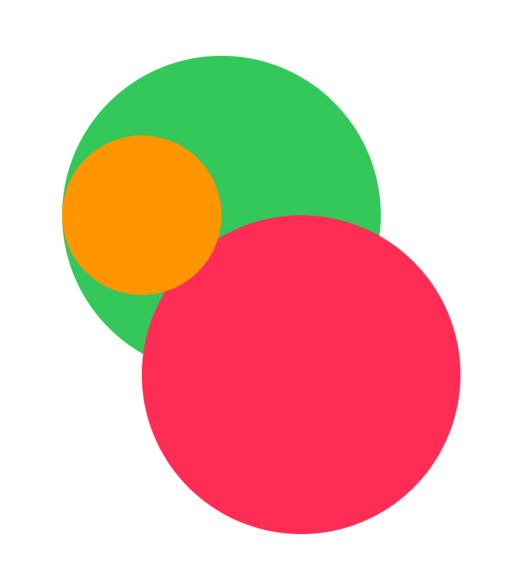
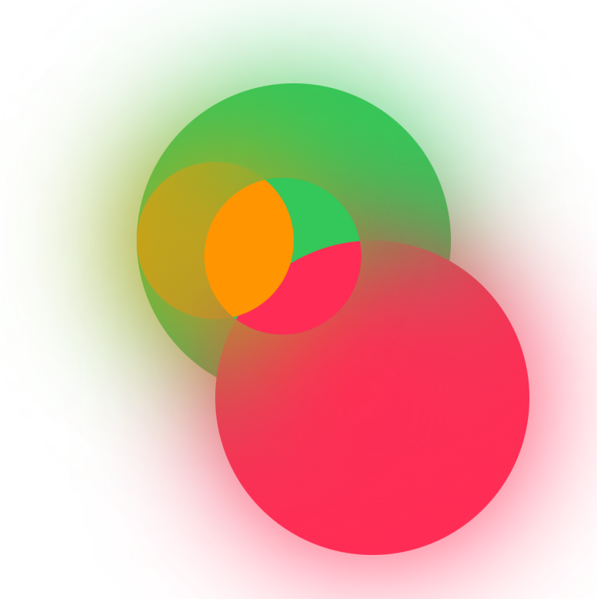

# Chris's SwiftUI Masked Blur

Blur a View allowing another View to act as a mask to knock a hole in the Blur, 
to reveal an unblurred version

## Overview

```
import SwiftUI
import MaskedBlur

struct MyCirclesView: View {

  var body: some View {
    MyCircles()
      .blur(radius: 40, opaque: false) {
        Circle()
          .path(in: CGRect(origin: CGPoint(x: 40, y: 20), size: CGSize(width: 150, height: 150)))
      }
  }
  
  var MyCircles: some View {
    ZStack {
      Circle()
        .fill(Color.green)
        .frame(height: 200)
      
      Circle()
        .fill(Color.pink)
        .frame(height: 200)
        .offset(x: 50, y: 100)
      
      Circle()
        .fill(Color.orange)
        .frame(height: 100)
        .offset(x: -50, y: 00)
    }
  }
}

struct MyCirclesView_Previews: PreviewProvider {
  static var previews: some View {
    MyCirclesView()
  }
}
```

| Before | After |
|--------|-------|
|


## Documentation

Documentation website here: https://nthstate.github.io/MaskedBlur/documentation/maskedblur/

Building the docs

```
swift build
```

```
PACKAGE_NAME=MaskedBlur
REPOSITORY_NAME=MaskedBlur
OUTPUT_PATH=./docs

swift package --allow-writing-to-directory $OUTPUT_PATH \
    generate-documentation --target $PACKAGE_NAME \
    --disable-indexing \
    --transform-for-static-hosting \
    --hosting-base-path $REPOSITORY_NAME \
    --output-path $OUTPUT_PATH
 ```
